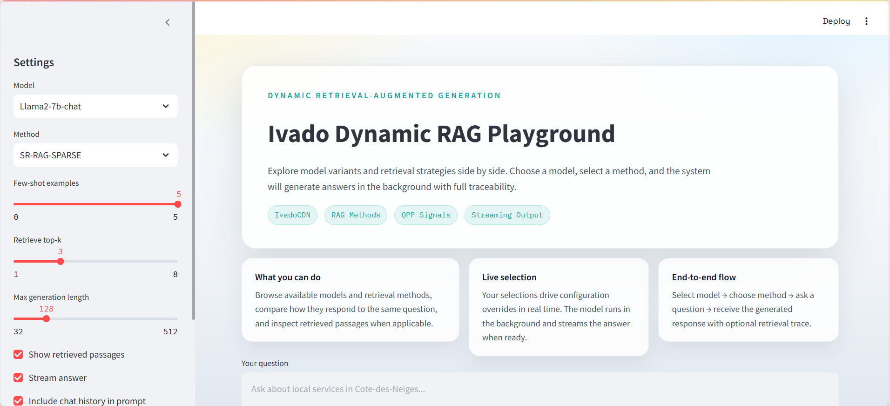
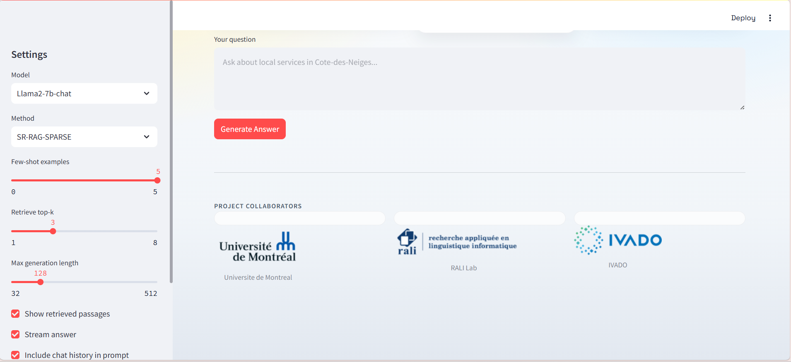

# IA Urbaine – RAG for Community Service Discovery in Côte-des-Neiges–Notre-Dame-de-Grâce

> **Research prototype.** Master's research internship at the **Université de Montréal**, **RALI Lab**, in collaboration with **IVADO** and **Nord Ouvert** (project *IA Urbaine*).

Repository: <https://github.com/oumnia-boudersa/ia-urbaine-cdn-rag>
Python package name: `dynamicrags` · Python 3.9 · License: MIT

---

## 1. What this project is

Residents of **Côte-des-Neiges–Notre-Dame-de-Grâce (CDN-NDG)**, Montréal, can access many community services (food, legal help, language classes, health, housing, employment…), but the information is scattered across directories, in French and English.

This repository contains a **prototype conversational assistant** built on **Retrieval-Augmented Generation (RAG)** to help people discover those services. It was developed in two stages:

1. Study of **Dynamic RAG** methods (DRAGIN and baselines) for conversational QA, starting from the public [DRAGIN](https://github.com/oneal2000/DRAGIN)-style framework.
2. Application and qualitative testing of these methods on a **custom bilingual corpus** of CDN-NDG community services (211 Québec and macommunaute.ca).

Three answering strategies are compared with the same prompting scheme and two Llama models:

| Strategy | Config `method` | Idea |
|---|---|---|
| **No RAG** | `non-retrieval` | The model answers from its parameters (+ few-shot exemplars) only |
| **Single RAG** | `single-retrieval` | One retrieval with the user question; top-k passages are put in the prompt |
| **Dynamic RAG (DRAGIN)** | `dragin` | Retrieval is triggered *during* generation when the model is uncertain, with a query built from the generated text (Su et al., 2024) |

The code also keeps the other strategies of the underlying framework: `fix-length-retrieval`, `fix-sentence-retrieval`, `token`, `entity`.

> ⚠️ **This is a feasibility study, not a benchmark.** Results are qualitative and based on a small number of queries. See [Results and observations](#8-results-and-observations) and [Limitations](#10-limitations).

---

## 2. Pipeline

```
 macommunaute.ca ──┐                                          ┌─► BM25 (sparse) ──┐
                   ├─► scrape ─► clean/translate ─► chunk ───┤                    ├─► retriever ─► prompt ─► Llama ─► answer
 211 Québec ───────┘   (FR/EN)     (notebooks)               └─► FAISS (dense) ──┘        ▲
                                                                                language detection
                                                                               (selects FR/EN indexes)
```

- **Bilingual routing** – `src/lang_utils.py` detects the question language (`langdetect`, with CDN-NDG place names stripped and a French stop-word heuristic) and `SparseRetrieverIvado.retrieve_auto_lang` selects the matching FR/EN index bundles.
- **Web demo** – `streamlit_app.py` (Streamlit) lets you pick the model and method, tune settings, ask a question and inspect the retrieved passages (see [Streamlit demo](#72-streamlit-demo)).
- **Four index bundles** – `{macommunaute, 211} × {en, fr}`, each with its own chunks, BM25 index and FAISS index.
- **Over-fetch + deduplication** of retrieved chunks before keeping the top-k.
- **Dense retrieval** – `sentence-transformers` model `paraphrase-multilingual-MiniLM-L12-v2` + FAISS (`FaissRetriever`).
- **Sparse retrieval** – BM25 over pickled indexes (`SparseRetrieverIvado`); TF-IDF is available as an alternative in `doc_indexing_project`.

---

## 3. Repository structure

```
dynamic_rags/
├── README.md
├── LICENSE                     # MIT
├── pyproject.toml              # package "dynamicrags", Python ~=3.9
├── requirements.txt            # base/dev requirements (see Installation)
├── Makefile                    # make requirements / lint / format
├── streamlit_app.py            # Streamlit web demo (model / method / settings / question)
├── assets/                     # logos shown in the demo: udem logo.png, rali lab.png, ivado.png
│
├── src/                        # RAG experiments (main code)
│   ├── main.py                 # batch inference over a queries file: python main.py -c <config.json>
│   ├── run_cli.py              # interactive / batch terminal runner (CSV output)
│   ├── generate_ivado.py       # strategies: BasicRAG, SingleRAG, FixLengthRAG, TokenRAG, EntityRAG, AttnWeightRAG (DRAGIN)
│   ├── data.py                 # IvadoCDN dataset, few-shot exemplars, prompt templates
│   ├── lang_utils.py           # FR/EN language detection for index routing
│   └── retrieve/
│       ├── retriever_ivado.py  # FaissRetriever (dense) and SparseRetrieverIvado (BM25), multi-bundle
│       ├── retriever.py        # original BM25 / SGPT retrievers from the base framework
│       └── beir/               # vendored BEIR 2.0.0 (used for BM25 utilities)
│
├── config/
│   ├── Llama2-7b-chat/IvadoCDN/    # DRAGIN.json, SR-RAG-DENSE.json, SR-RAG-SPARSE.json, wo-RAG.json
│   ├── Llama2-13b-chat/IvadoCDN/
│   ├── personas.json               # persona definitions
│   ├── categories.json             # service categories
│   └── cdn_rag_queries.json        # persona queries (Simple / Medium / Hard)
│
├── scraper/                    # Selenium scraper for macommunaute.ca (one .txt + .pdf per theme)
├── notebooks/                  # data pipeline, in order:
│   ├── 0_scrap.ipynb · 0_translate_to_en.ipynb
│   ├── 1_data_processing.ipynb · 2_categorize.ipynb
│   ├── 3_chunk.ipynb · 4_pyserini_index.ipynb
│   └── embeedings.ipynb
├── doc_indexing_project/       # standalone indexing library + scripts (chunker, BM25/TF-IDF, FAISS)
│   ├── src/                    # chunker, document_loader, sparse_index, dense_index, chunk_loader
│   └── scripts/                # build_index.py, build_from_chunks.py, build_211_index.py, build_macommunaute_index.py, search_index.py …
├── scripts/                    # Pyserini BM25 helpers (PowerShell / bash)
├── data/
│   ├── 1_raw/                  # raw scraped data (211data, macommunaute)
│   ├── 2_processed/            # cleaned data and chunks.json
│   ├── 3_indexes/              # {all,dense_index,sparse_index}/{211,macommunaute}/{en,fr}/
│   ├── queries.json            # test queries by persona and difficulty
│   └── cdn_rag_queries.json
├── dynamicrags/                # packaging stub from the project template (config, dataset, plots…)
├── references/                 # reference code from the base framework
├── docs/images/                # screenshots used in this README
├── reports/ · tests/           # template folders (mostly empty)
```

> Large artefacts (indexes `*.pkl`/`*.faiss`, `chunks.json`) are not meant to be committed to Git – see [Data and indexes](#5-data-and-indexes).

---

## 4. Installation

```bash
git clone https://github.com/oumnia-boudersa/ia-urbaine-cdn-rag.git
cd ia-urbaine-cdn-rag

conda create -n env python=3.9 -y
conda activate env

pip install -r requirements.txt           # base tools (numpy, pandas, scikit-learn, jupyter…) + the package
pip install -r doc_indexing_project/requirements.txt   # chunking + BM25 + sentence-transformers + faiss-cpu
```

The inference code additionally needs the following packages, which are **not** listed in `requirements.txt`:

```bash
pip install torch transformers accelerate datasets sentence-transformers faiss-cpu rank-bm25 langdetect jieba spacy pandas numpy tqdm
pip install selenium reportlab      # only for the macommunaute.ca scraper (needs Google Chrome)
python -m spacy download fr_core_news_sm   # optional: French tokenization for BM25
```

- `faiss-gpu` can be used instead of `faiss-cpu` on a GPU machine.
- **Models**: `meta-llama/Llama-2-7b-chat-hf` (and 13B) require accepting Meta's licence on Hugging Face and logging in (`huggingface-cli login`). `meta-llama/Llama-3.2-1B-Instruct` was also used in the experiments: copy a config and set `model_name_or_path` to it.
- Secrets (e.g. tokens) go in a local `.env` file, which is git-ignored.

---

## 5. Data and indexes

**Sources** (public directories, CDN-NDG area):

| Source | Languages | Notes |
|---|---|---|
| [macommunaute.ca](https://macommunaute.ca/bottin-des-organismes/) | FR / EN | Directory of organisations; scraped by theme with `scraper/` |
| [211 Québec](https://www.211qc.ca/) | FR / EN | Directory of community, social and health services |

**Processing** (notebooks `0_*` → `4_*`): scrape → translate FR↔EN → clean/structure → categorise by theme → chunk → build BM25 and FAISS indexes.

- **Chunking**: recursive fixed-size chunking with overlap (`doc_indexing_project/src/chunker.py`). An organisation-level chunking option exists but the current indexes were **not rebuilt** with it.
- **Index layout** (as used by the configs):

```
data/3_indexes/
├── dense_index/{211,macommunaute}/{en,fr}/{dense_index.faiss, chunks.pkl}
└── sparse_index/{211,macommunaute}/{en,fr}/{sparse_index.pkl, chunks.pkl}
```

- **Rebuilding indexes** (from pre-chunked data) – see `doc_indexing_project/README.md`, `QUICK_START_PRECHUNKED.md` and the scripts `build_from_chunks.py`, `build_211_index.py`, `build_macommunaute_index.py`.

> **Path convention (required).** The provided configs read their data from `data/ivadodata/` (`data_path: "data/ivadodata"`, `queries_file: "queries.json"`, indexes under `data/ivadodata/3_indexes/...`). Create that folder from the repository's `data/` folder before running anything:
>
> ```bash
> # Linux / macOS / Git Bash
> mkdir -p data/ivadodata
> cp -r data/3_indexes data/ivadodata/3_indexes
> cp data/queries.json data/ivadodata/queries.json
> ```
> ```powershell
> # Windows PowerShell
> New-Item -ItemType Directory -Force data\ivadodata
> Copy-Item -Recurse data\3_indexes data\ivadodata\3_indexes
> Copy-Item data\queries.json data\ivadodata\queries.json
> ```
>

**Ethics / terms of use.** Data come from public directories. Check each source's terms of use before redistributing scraped content; do not commit credentials or personal data.

---

## 6. Configuration

Configs are JSON files in `config/Llama2-7b-chat/IvadoCDN/`:

| File | Strategy | Retriever |
|---|---|---|
| `wo-RAG.json` | No RAG (`non-retrieval`) | – |
| `SR-RAG-SPARSE.json` | Single RAG | BM25 over the 4 bundles |
| `SR-RAG-DENSE.json` | Single RAG | FAISS over the 4 bundles |
| `DRAGIN.json` | Dynamic RAG (`dragin`) | BM25 over the 4 bundles |

Main fields:

| Field | Meaning |
|---|---|
| `model_name_or_path` | Hugging Face id or local path |
| `method` | `non-retrieval`, `single-retrieval`, `dragin`, … |
| `dataset`, `data_path`, `queries_file` | `ivado_cdn`; folder and file of test queries |
| `fewshot` | Number of few-shot exemplars (0 = zero-shot) |
| `generate_max_length` | Max generated tokens (128 in the shipped configs) |
| `retriever` | `SPARSE` (BM25) or `FAISS` (dense) |
| `sparse_index_path` / `faiss_index_path`, `faiss_pkl_path` | Lists of index files (one per bundle) |
| `sparse_text_key`, `faiss_text_key`, `*_id_key` | Field names in the chunk records (`content`, `chunk_id`) |
| `retrieve_topk` | Retrieved passages (3) |
| `query_formulation` | `direct` (question) or `real_words` (DRAGIN query from generated text) |
| `hallucination_threshold`, `retrieve_keep_top_k`, `check_real_words` | DRAGIN triggering and query-building settings |
| `output_dir` | Results folder (a numbered sub-folder is created per run) |
| `generation_seed` | Seed (42) |

⚠️ The shipped configs use **different** `fewshot` values (0 / 3 / 7). For a fair comparison, override it identically for all strategies (see `--fewshot` below).

---

## 7. Usage

Run commands from the repository root (paths in the configs are relative to it).

### 7.1 Batch inference over the queries file

```bash
python src/main.py -c config/Llama2-7b-chat/IvadoCDN/SR-RAG-SPARSE.json
```

Writes `config.json` and `output.txt` (one JSON line per query: `qid`, `prediction`, token/retrieval counters) to the run folder `output_dir/0/`, `output_dir/1/`, ….

### 7.2 Streamlit demo

An interactive demo, **"Ivado Dynamic RAG Playground"**, lets you compare models and retrieval strategies side by side on the same question.

```bash
pip install streamlit
streamlit run streamlit_app.py      # from the repository root; opens http://localhost:8501
```



**Sidebar settings**

| Control | Values | Effect |
|---|---|---|
| **Model** | one entry per model folder under `config/` (e.g. `Llama2-7b-chat`) | Selects the LLM |
| **Method** | one entry per JSON config of that model (`wo-RAG`, `SR-RAG-SPARSE`, `SR-RAG-DENSE`, `DRAGIN`) | Selects the strategy and retriever |
| **Few-shot examples** | 0 – 5 | Number of exemplars in the prompt |
| **Retrieve top-k** | 1 – 8 | Number of retrieved passages (retrieval methods only) |
| **Max generation length** | 32 – 512 | Max generated tokens |
| **Show retrieved passages** | on/off | Displays the passages used, in an expander |
| **Stream answer** | on/off | Streams the answer as it is generated |
| **Include chat history in prompt** | on/off | Adds previous turns to the prompt |
| **Show config** / **Clear chat history** | – | Shows the loaded config / resets the conversation |

Type a question in **Your question** (e.g. *"Ask about local services in Cote-des-Neiges…"*) and click **Generate Answer**. The answer is shown with optional *Retrieved passages*, *Chat history* and *Run details* panels. The page ends with the logos of the collaborators (Université de Montréal, RALI Lab, IVADO).



Notes:
- The app builds its model list by scanning `IvadoCDN/*.json` configs under a config root and loads the selected model on demand, so the first request is slow (Llama-2-7B needs a GPU with enough memory).
- It imports `src/data.py` and `src/generate_ivado.py`, so the same `data/ivadodata/` setup as above is required.
- The logos are read from `assets/udem logo.png`, `assets/rali lab.png` and `assets/ivado.png`;

### 7.3 Terminal runner (no web interface needed)

Interactive, one config:

```bash
python src/run_cli.py --config config/Llama2-7b-chat/IvadoCDN/SR-RAG-SPARSE.json
```

Compare strategies on one or more questions, saved to CSV (`strategy,question,answer`):

```bash
python src/run_cli.py \
  --run no_rag=config/Llama2-7b-chat/IvadoCDN/wo-RAG.json \
  --run single_sparse=config/Llama2-7b-chat/IvadoCDN/SR-RAG-SPARSE.json \
  --run single_dense=config/Llama2-7b-chat/IvadoCDN/SR-RAG-DENSE.json \
  --run dragin=config/Llama2-7b-chat/IvadoCDN/DRAGIN.json \
  --question "Where can I find free legal help in Côte-des-Neiges?" \
  --fewshot 3 --max-length 256 --show-passages \
  --out outputs.csv
```

### 7.4 Building / searching indexes

```bash
cd doc_indexing_project
python scripts/build_from_chunks.py --help   # build BM25 + FAISS indexes from pre-chunked JSON
python scripts/search_index.py --query "free legal help Côte-des-Neiges" --top-k 5
```

### 7.5 Scraping macommunaute.ca

```bash
python -m scraper.main      # opens Chrome via Selenium; writes one .txt and one .pdf per theme to data/raw/macommunaute/
```

---

## 8. Compute

Experiments were run on a RALI Lab Slurm node (`octal41`: 64 CPU cores, 4 GPUs `ls40`, ~515 GB RAM) in a conda environment with Python 3.9. The system is **not deployed** as a public service because hosting a 7B model requires GPU resources and cost beyond the scope of the internship.

---

## 9. Future work

- Rebuild indexes with organisation-level chunks and filter directory/index pages.
- Extend the gold set to all personas and compute recall@k, answer correctness and faithfulness.
- Hybrid (BM25 + dense) retrieval and reranking; source citation and contact-detail verification.
- Evaluate stronger/hosted models and a lightweight deployment; evaluation with residents and service providers.

---

## 10. References

- Su, W., Tang, Y., Ai, Q., Wu, Z., Liu, Y. (2024). *DRAGIN: Dynamic Retrieval Augmented Generation based on the Information Needs of Large Language Models.* ACL 2024.
- Touvron, H. et al. (2023). *Llama 2: Open Foundation and Fine-Tuned Chat Models.*
- Thakur, N. et al. (2021). *BEIR: A Heterogeneous Benchmark for Zero-shot Evaluation of Information Retrieval Models.*
- Reimers, N., Gurevych, I. (2019). *Sentence-BERT.*
- Johnson, J., Douze, M., Jégou, H. (2019). *Billion-scale similarity search with GPUs* (FAISS).

## 11. Acknowledgments

Thanks to the **RALI Lab** and the **Université de Montréal** for supervision and compute resources, and to **IVADO** and **Nord Ouvert** for the *IA Urbaine* collaboration.

## 12. License and citation

Code released under the **MIT License** (see `LICENSE`). Llama models and scraped data are subject to their own licences and terms.